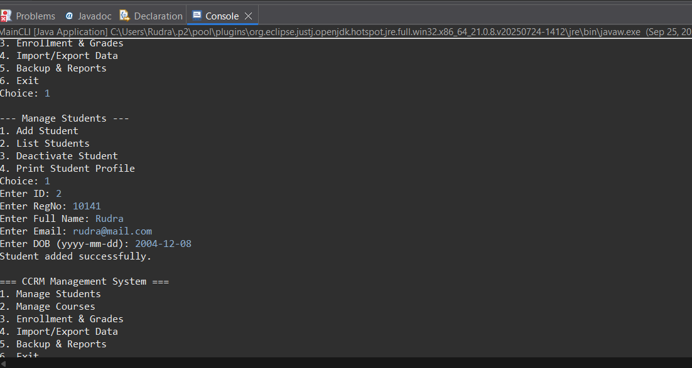
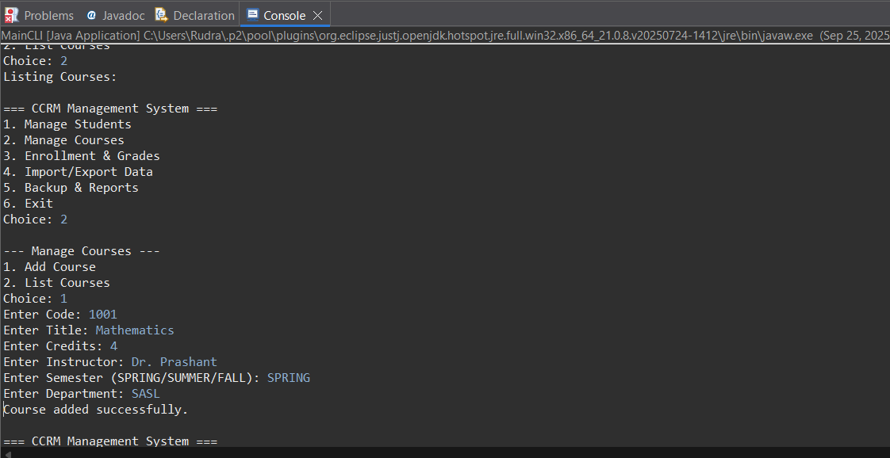
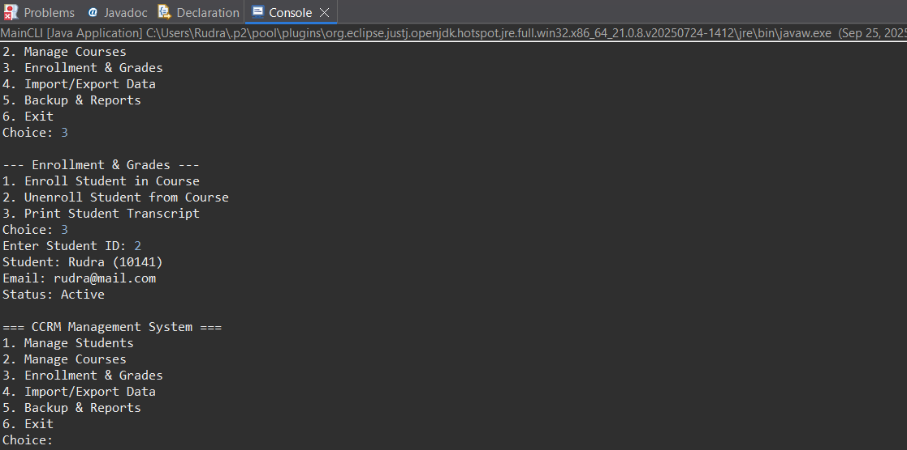

# Campus Course Records Manager (CCRM)

## Project Overview
CCRM is a Java-based CLI project to manage students, courses, and enrollments in a university.  
Features include adding students/courses, enrollment with credit limits, duplicate-check prevention, and custom exception handling.

## How to Run
- **JDK Version**: Java 25 (tested on Eclipse IDE 2025-09)
- **Steps**:
  1. Clone the repo:  
     ```bash
     git clone https://github.com/<your-username>/CampusCourseRecordsManager.git
     ```
  2. Import into Eclipse (`File → Import → Existing Projects → Select Folder`).
  3. Run `edu.ccrm.cli.MainCLI` as a Java Application.
  4. Use the menu-driven interface.

---

## Evolution of Java (short bullets)
- **1995**: Java 1.0 released – “Write Once, Run Anywhere”
- **2004**: Java 5 introduced Generics, Annotations, Enums
- **2011**: Java 7 – try-with-resources, NIO.2
- **2014**: Java 8 – Lambdas, Streams, Optional
- **2017**: Java 9+ – Modules system (JPMS)
- **2021+**: Modern releases (records, switch expressions, pattern matching)

---

## ☕ Java Editions (ME vs SE vs EE)
- **Java SE (Standard Edition)** → Core Java (OOP, libraries, CLI apps) – *used here*
- **Java EE (Enterprise Edition)** → Web apps, enterprise-scale apps (Servlets, JSP, EJB)
- **Java ME (Micro Edition)** → Mobile/embedded devices, small footprint

---

## JDK / JRE / JVM
- **JVM**: Virtual machine that runs Java bytecode.
- **JRE**: JVM + runtime libraries (for running Java).
- **JDK**: JRE + compilers + dev tools (for developing Java).

---

## Installation & Setup
### Install JDK on Windows
1. Download from Oracle/OpenJDK.
2. Install to your desired location
3. Set `JAVA_HOME` and update `PATH`.


## Screenshots

- **JDK Verification:**  
  

- **Eclipse Setup:**  
  

- **Program Running:**  
  
  
  
  

